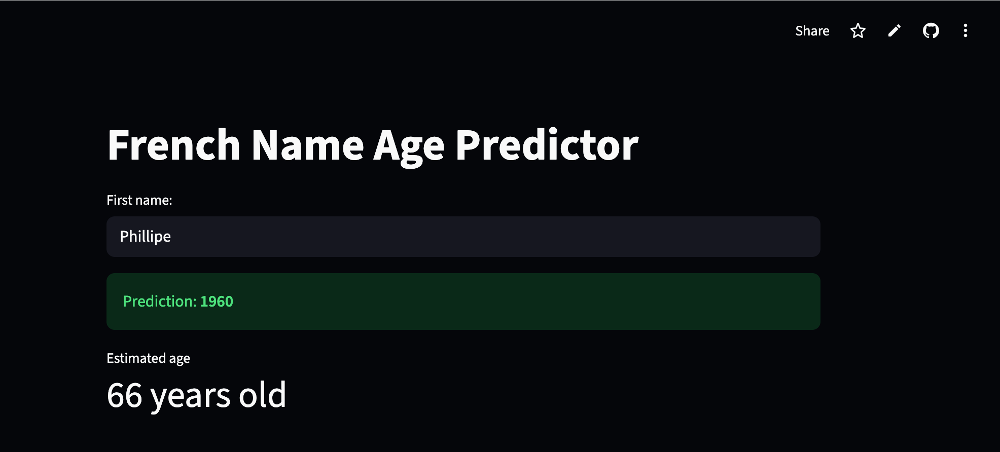
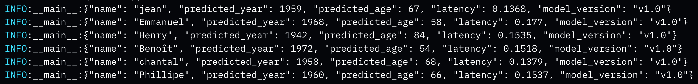

# French name-to-age predictor (Deep Learning)

## 1. Description 
This is an end-to-end machine learning application that predicts a person's birth year based on their first name, trained on historical French demographic dataset [INSEE - National Institute of Statistics and Economic Studies](https://www.insee.fr/fr/statistiques/fichier/7633685/dpt_2000_2022_csv.zip)

## 2. Live demo with streamlit
https://french-age-predictor-ba93deuaxymamvt5ebh64g.streamlit.app/



## 3. Features
- Deep learning Engine : LSTM-based architecture built with TensorFlow/ Kears
- Docker : the project was containerized with Docker for cross-platform consistency
- CI/CD pipeline : integrated CI/CD pipeline using Github Actions
- Observability : implemented a structured JSON logging to track model latency and inference results
- Streamlit : deployed via streamlit for live demo 

## 4. Data & Model architecture
- Dataset : used only two variables ("preusuel" - first year as explanatory variable and "annais" - birth year as response variable)
- Preprocessing : custom tokenizer for character-level name encoding and a MinMaxScaler for target year normalization 
- Model with layers
   + Embedding Layer 
   + LSTM Layer 
   + Dense Layers with Dropout 
   + Output : predicted birth year

## 5. Techstack
- ML framework : TensorFlow/ Kears
- Data handling : Pandas, scikit-learn, numpy
- Web interface : Streamlit
- DevOps : docker, Github Actions

## 6. Local installation and setup
- Clone the repository
```bash
git clone https://github.com/Linhkobe/french-age-predictor.git
```

- Run via Docker
```bash
docker build -t age-predictor-app . 
```

```bash
docker run -p 8080:8080 age-predictor-app 
```

- Then acces the app at [this link](http://localhost:8080)


## 7. Monitoring & Logs
The application tracks every prediction for performance monitoring. Logs are output in structured JSON format for easy ingestion by cloud logging systems, such as GCP Cloud Logging or ELK stack

